# Coworking Space Service Extension
The Coworking Space Service is a set of APIs that enables users to request one-time tokens and administrators to authorize access to a coworking space. This service follows a microservice pattern and the APIs are split into distinct services that can be deployed and managed independently of one another.

For this project, you are a DevOps engineer who will be collaborating with a team that is building an API for business analysts. The API provides business analysts basic analytics data on user activity in the service. The application they provide you functions as expected locally and you are expected to help build a pipeline to deploy it in Kubernetes.

## Getting Started

### Dependencies
#### Local Environment
1. Python Environment - run Python 3.6+ applications and install Python dependencies via `pip`
2. Docker CLI - build and run Docker images locally
3. `kubectl` - run commands against a Kubernetes cluster
4. `helm` - apply Helm Charts to a Kubernetes cluster

#### Remote Resources
1. AWS CodeBuild - build Docker images remotely
2. AWS ECR - host Docker images
3. Kubernetes Environment with AWS EKS - run applications in k8s
4. AWS CloudWatch - monitor activity and logs in EKS
5. GitHub - pull and clone code

### Setup
#### 1. Configure a Database
Set up a Postgres database using a Helm Chart.

1. Set up Bitnami Repo
```bash
helm repo add <REPO_NAME> https://charts.bitnami.com/bitnami
```

2. Install PostgreSQL Helm Chart
```
helm install <SERVICE_NAME> <REPO_NAME>/postgresql
```

This should set up a Postgre deployment at `<SERVICE_NAME>-postgresql.default.svc.cluster.local` in your Kubernetes cluster. You can verify it by running `kubectl svc`

By default, it will create a username `postgres`. The password can be retrieved with the following command:
```bash
export POSTGRES_PASSWORD=$(kubectl get secret --namespace default <SERVICE_NAME>-postgresql -o jsonpath="{.data.postgres-password}" | base64 -d)

echo $POSTGRES_PASSWORD
```

<sup><sub>* The instructions are adapted from [Bitnami's PostgreSQL Helm Chart](https://artifacthub.io/packages/helm/bitnami/postgresql).</sub></sup>

3. Test Database Connection
The database is accessible within the cluster. This means that when you will have some issues connecting to it via your local environment. You can either connect to a pod that has access to the cluster _or_ connect remotely via [`Port Forwarding`](https://kubernetes.io/docs/tasks/access-application-cluster/port-forward-access-application-cluster/)

* Connecting Via Port Forwarding
```bash
kubectl port-forward --namespace default svc/<SERVICE_NAME>-postgresql 5432:5432 &
    PGPASSWORD="$POSTGRES_PASSWORD" psql --host 127.0.0.1 -U postgres -d postgres -p 5432
```

* Connecting Via a Pod
```bash
kubectl exec -it <POD_NAME> bash
PGPASSWORD="<PASSWORD HERE>" psql postgres://postgres@<SERVICE_NAME>:5432/postgres -c <COMMAND_HERE>
```

4. Run Seed Files
We will need to run the seed files in `db/` in order to create the tables and populate them with data.

```bash
kubectl port-forward --namespace default svc/<SERVICE_NAME>-postgresql 5432:5432 &
    PGPASSWORD="$POSTGRES_PASSWORD" psql --host 127.0.0.1 -U postgres -d postgres -p 5432 < <FILE_NAME.sql>
```

### 2. Running the Analytics Application Locally
In the `analytics/` directory:

1. Install dependencies
```bash
pip install -r requirements.txt
```
2. Run the application (see below regarding environment variables)
```bash
<ENV_VARS> python app.py
```

There are multiple ways to set environment variables in a command. They can be set per session by running `export KEY=VAL` in the command line or they can be prepended into your command.

* `DB_USERNAME`
* `DB_PASSWORD`
* `DB_HOST` (defaults to `127.0.0.1`)
* `DB_PORT` (defaults to `5432`)
* `DB_NAME` (defaults to `postgres`)

If we set the environment variables by prepending them, it would look like the following:
```bash
DB_USERNAME=username_here DB_PASSWORD=password_here python app.py
```
The benefit here is that it's explicitly set. However, note that the `DB_PASSWORD` value is now recorded in the session's history in plaintext. There are several ways to work around this including setting environment variables in a file and sourcing them in a terminal session.

3. Verifying The Application
* Generate report for check-ins grouped by dates
`curl <BASE_URL>/api/reports/daily_usage`

* Generate report for check-ins grouped by users
`curl <BASE_URL>/api/reports/user_visits`

## Project Instructions
1. Set up a Postgres database with a Helm Chart
2. Create a `Dockerfile` for the Python application. Use a base image that is Python-based.
3. Write a simple build pipeline with AWS CodeBuild to build and push a Docker image into AWS ECR
4. Create a service and deployment using Kubernetes configuration files to deploy the application
5. Check AWS CloudWatch for application logs

### Deliverables
1. `Dockerfile`
2. Screenshot of AWS CodeBuild pipeline
3. Screenshot of AWS ECR repository for the application's repository
4. Screenshot of `kubectl get svc`
5. Screenshot of `kubectl get pods`
6. Screenshot of `kubectl describe svc <DATABASE_SERVICE_NAME>`
7. Screenshot of `kubectl describe deployment <SERVICE_NAME>`
8. All Kubernetes config files used for deployment (ie YAML files)
9. Screenshot of AWS CloudWatch logs for the application
10. `README.md` file in your solution that serves as documentation for your user to detail how your deployment process works and how the user can deploy changes. The details should not simply rehash what you have done on a step by step basis. Instead, it should help an experienced software developer understand the technologies and tools in the build and deploy process as well as provide them insight into how they would release new builds.


### Stand Out Suggestions
Please provide up to 3 sentences for each suggestion. Additional content in your submission from the standout suggestions do _not_ impact the length of your total submission.
1. Specify reasonable Memory and CPU allocation in the Kubernetes deployment configuration
2. In your README, specify what AWS instance type would be best used for the application? Why?
3. In your README, provide your thoughts on how we can save on costs?

### Best Practices
* Dockerfile uses an appropriate base image for the application being deployed. Complex commands in the Dockerfile include a comment describing what it is doing.
* The Docker images use semantic versioning with three numbers separated by dots, e.g. `1.2.1` and  versioning is visible in the  screenshot. See [Semantic Versioning](https://semver.org/) for more details.

#### Project Structure
```shell

|   .DS_Store
|   buildspec.yml
|   CODEOWNERS
|   LICENSE.txt
|   README.md
|
+---.github
|   \---workflows
|           manual.yml
|
+---analytics
|       app.py
|       config.py
|       Dockerfile
|       model.py
|       requirements.txt
|       __init__.py
|
+---bin
|       create_ecr.sh
|       create_eks_cluster.sh
|
+---db
|       1_create_tables.sql
|       2_seed_users.sql
|       3_seed_tokens.sql
|
+---deployment
|       configmap.yaml
|       coworking.yaml
|       secret.yaml
|
+---deployment-local
|       configmap.yaml
|       coworking.yaml
|
\---screenshot
        api_daily_usage.png
        api_health_check.png
        api_readiness_check.png
        api_user_visits.png
        cloudwatch.png
        codebuild_log.png
        codebuild_success.png
        create_ecr.png
        kubectl_describe_deployemnt_1.png
        kubectl_describe_deployemnt_2.png
        kubectl_describe_svc_1.png
        kubectl_describe_svc_2.png
        kubectl_describe_svc_3.png
        kubectl_info.png
        logs.png
```
#### Run project
1. Create a Kubernetes cluster.
- Run `./bin/create_eks_cluster.sh`
2. Create a ECR
- Run `./bin/create_ecr.sh`
3. Add repo bitnami to heml and update repo
- Run `helm repo add bitnami https://charts.bitnami.com/bitnam`
- Run `helm repo update`
4. Install PostgresSQL to heml
- Run `helm install prj3 bitnami/postgresql --set primary.persistence.enabled=false`
5. Forward port
- Run `kubectl get svc`
- Run `kubectl port-forward svc/<NAME OF POSTGRES SERVICE> 5432:5432 &`
6. Deployment
- Run `cd/deployment`
- Run `kubectl apply -f .`

### CloudWatch Metrics in EKS
1. Run `aws iam attach-role-policy \
--role-name my-worker-node-role \
--policy-arn arn:aws:iam::aws:policy/CloudWatchAgentServerPolicy`
- Replace my-worker-node-role with your EKS cluster's Node Group's IAM role.
2. Run `aws eks create-addon --addon-name amazon-cloudwatch-observability --cluster-name <my-cluster-name>`
3. Trigger logging by accessing your application.
4. Open up CloudWatch Log groups page. You should see aws/containerinsights/my-cluster-name/application.

### Get Web API URL

1. Get the load balancer external IP:
 
   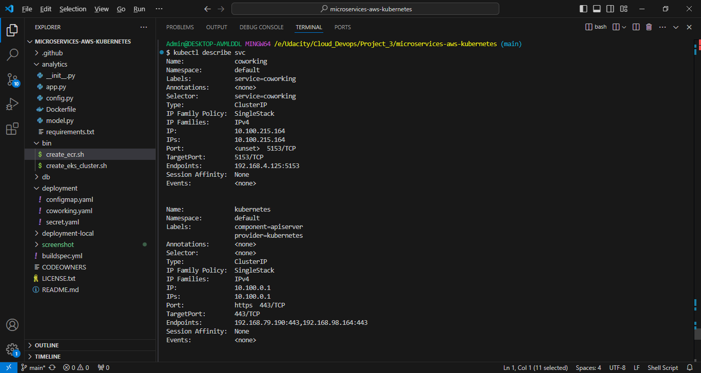
   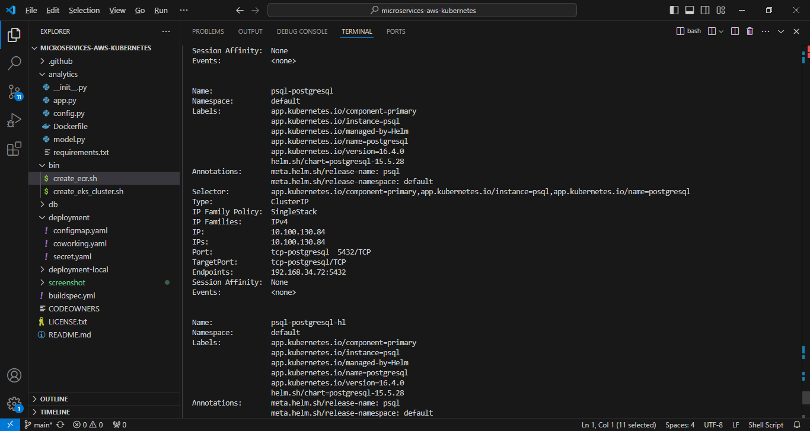
   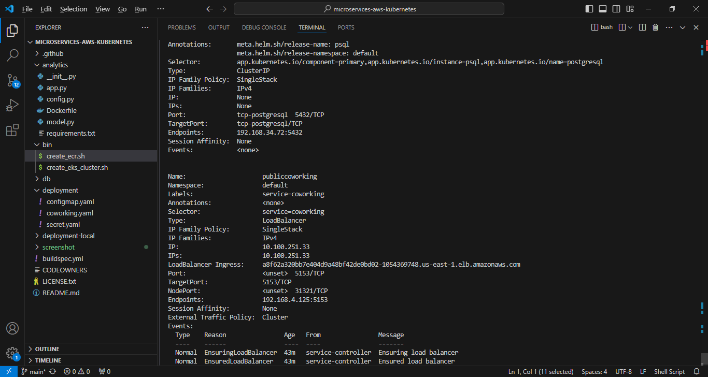

2. Access the Web API using the provided external IP.
- LINK API USER_VISITS: `http://a8f62a320bb7e404d9a48bf42de0bd02-1054369748.us-east-1.elb.amazonaws.com:5153/api/reports/user_visits`
   

- LINK API DAILY_USAGE: `http://a8f62a320bb7e404d9a48bf42de0bd02-1054369748.us-east-1.elb.amazonaws.com:5153/api/reports/daily_usage`
   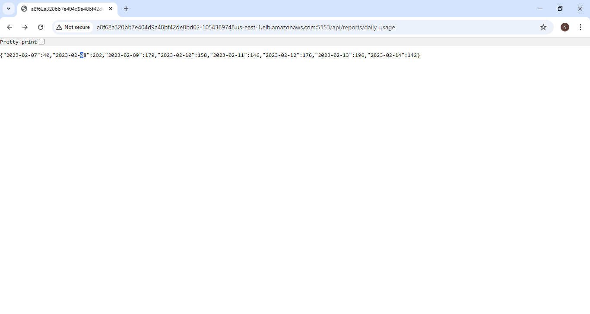

- LINK API HEALTH_CHECK: `http://a8f62a320bb7e404d9a48bf42de0bd02-1054369748.us-east-1.elb.amazonaws.com:5153/health_check`
   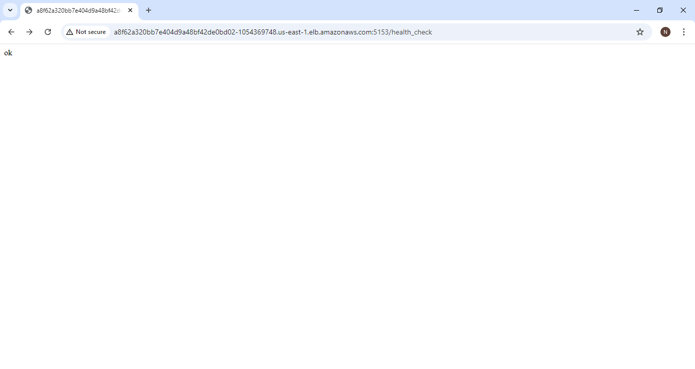

- LINK API READINESS_CHECK: `http://a8f62a320bb7e404d9a48bf42de0bd02-1054369748.us-east-1.elb.amazonaws.com:5153/readiness_check`
   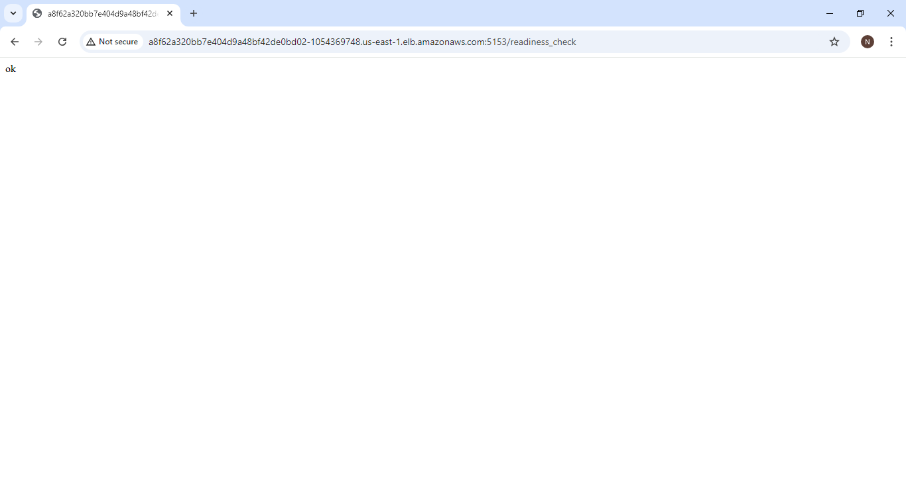

### CloudWatch

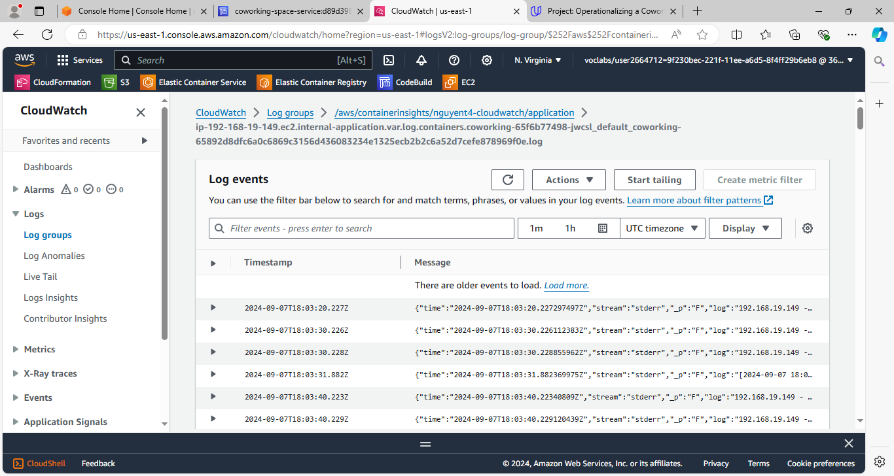
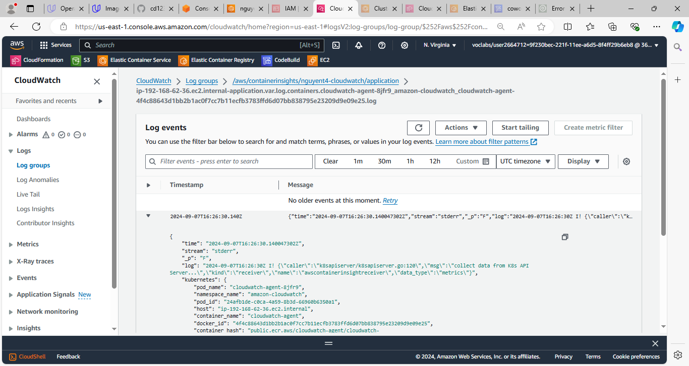

### CoudeBuild

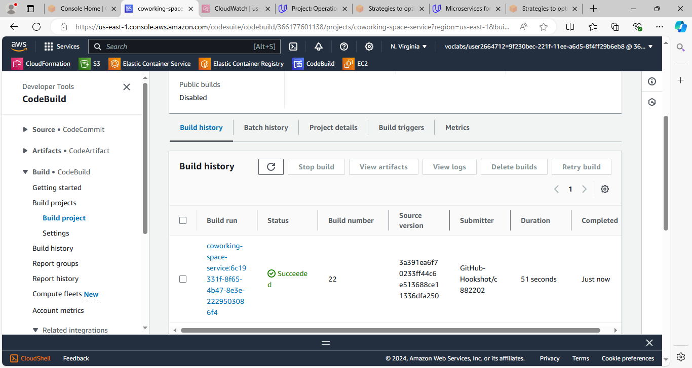
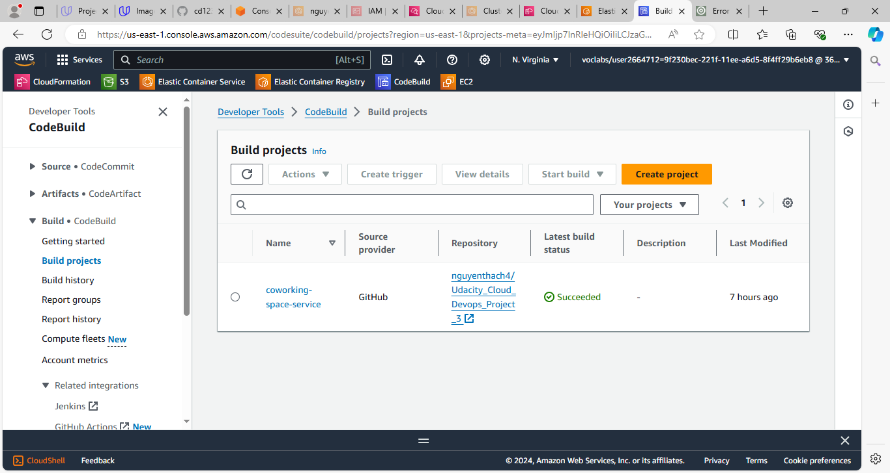
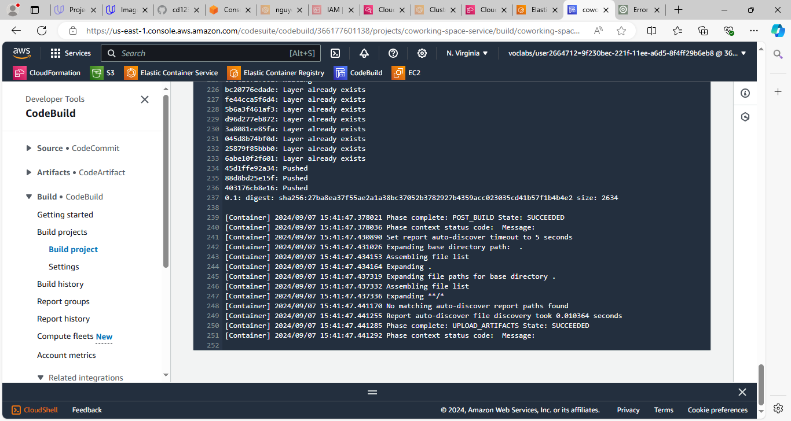

### ECR

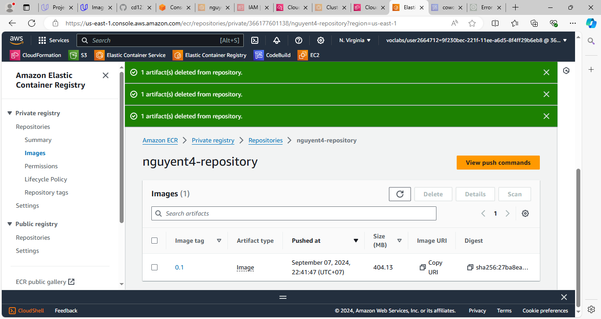